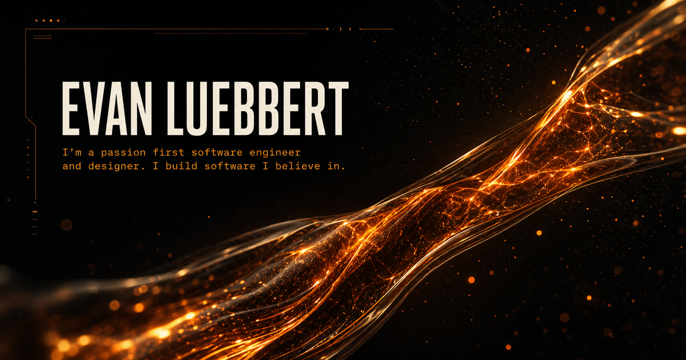

# Evan Luebbert

The source for [Evan Luebbert's portfolio](https://evan-luebbert.luebbertevan.chatgpt.site), an interactive WebGL experience built around a continuous procedural world and direct, shareable project routes.



## Run locally

Requires Node.js 22.13 or newer.

```bash
npm install
npm run dev
```

Use `npm test` to create a production build and run the rendered-page checks.

## Structure

- `app/` contains the portfolio routes, interface, WebGL renderer, shaders, and particle simulation.
- `public/` contains the portfolio images, videos, fonts, résumé, and social preview.
- `tests/` contains the production-render and source-level regression checks.

## License

The source code is available under the [MIT License](LICENSE). Portfolio copy, résumé content, photography, screenshots, video, and other media are excluded from that license; see [CONTENT-LICENSE.md](CONTENT-LICENSE.md).
